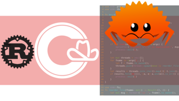

# Calgary Rust

## Discord server

Join the discussions on the [Calgary-Rust discord server](https://discord.gg/rTUEWr89).

## Meetings

Check "Upcoming Events" on [Rust Calgary eventbrite](https://www.eventbrite.ca/o/rust-calgary-63449860593).

### mini-hackathons

This is not happening currently. The idea is short lunchtime meetings to present projects we're working on, help each other with questions, etc...

### Presentations

Join the [discord server](# Discord server) if you want to do discuss a presentation. Ideas:

* conference report (one in planning for end of September)
* People using Rust in production today
* experience on a large-ish Rust Open Source project

## Resources

Check the [resource page](resources.md) for links to install and learn Rust, discord servers, practice sites and software.

